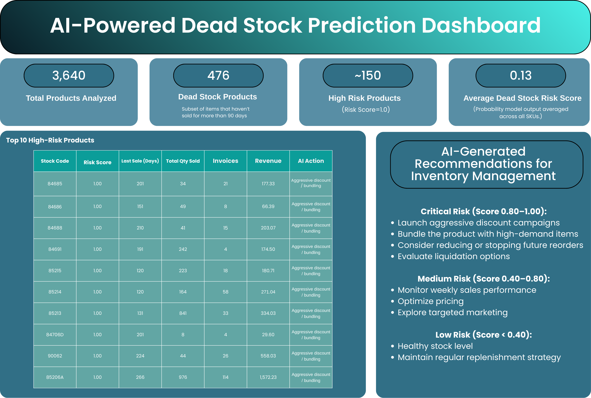
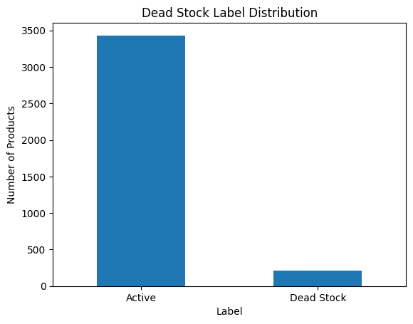
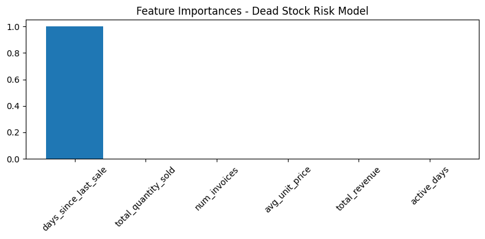
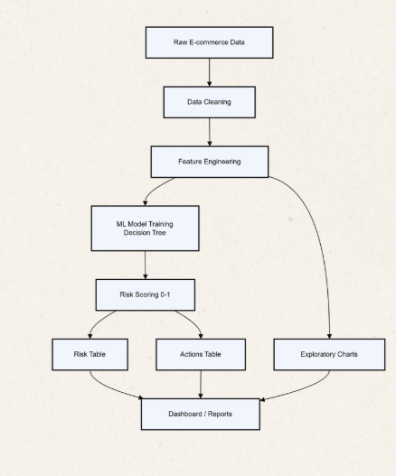

# AI-Powered Dead Stock Prediction System

This project predicts **dead stock risk** in e-commerce using machine learning and historical transaction data.
The system labels products as dead stock if they have **not been sold for more than 90 days**, then trains a model to estimate a **risk score (0–1)** and generates **actionable inventory recommendations**.

---

## 🎯 Problem
Dead stock products occupy warehouse space, block working capital, and often lead to heavy discounting or write-offs.
In fast-changing e-commerce catalogs, manually tracking thousands of SKUs is not scalable.

**Dead stock definition used in this project:**  
A product is labeled as *dead stock* if `days_since_last_sale > 90`.

---

## 🧠 Solution Overview
End-to-end pipeline implemented in Python (Google Colab):

1. Data cleaning & preprocessing  
2. Feature engineering at SKU level  
3. Dead stock labeling (90-day rule)  
4. Model training (Decision Tree)  
5. Risk scoring and rule-based action recommendations  

---

## 🧾 Dataset & Outputs
- Product-level dataset created after cleaning and aggregation
- Output tables:
  - **Risk Table:** SKUs ranked by dead stock probability
  - **Actions Table:** business-friendly recommendations (healthy, monitor, promote, liquidate)

---

## 🧩 Dashboard Overview (Business View)
This dashboard mockup demonstrates how model outputs can be consumed by business users for inventory decisions.

---

## 📈 Key Visuals

### Dead Stock Label Distribution

### Feature Importance

### System Architecture

---

## 🚦 Risk-Based Action Rules
| Risk Score | Recommendation |
|-----------|----------------|
| < 0.40 | Healthy stock |
| 0.40 – 0.60 | Monitor closely and optimize pricing |
| 0.60 – 0.80 | Run promotion and reduce future orders |
| ≥ 0.80 | Aggressive discount / bundling / consider liquidation |

---

## 🛠 Tech Stack
- Python
- pandas, numpy
- matplotlib
- scikit-learn
- Google Colab

---

## 📁 Repository Structure
- `notebooks/` → analysis & model training notebook  
- `data/` → dataset (or sample dataset)  
- `report/` → project report (PDF)  
- `images/` → dashboard and visual outputs  

---

## 📄 Report
Project report is available in: `report/dead_stock_project_report.pdf`
